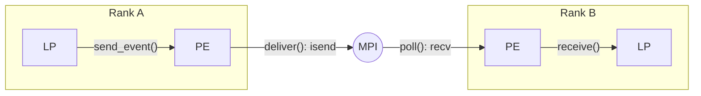

# Communication Patterns

```mermaid
flowchart LR
    subgraph rankA [Rank A]
        LP1[LP] -- "send_event()" --> PE1[PE]
    end
    subgraph rankB [Rank B]
        PE2[PE] -- "receive()" --> LP2[LP]
    end
    PE1 -- "deliver(): isend" --> MPI((MPI))
    MPI -- "poll(): recv" --> PE2
```

There should be one, and only one Engine.

PE -> MPIBase, maybe keep an Engine reference
